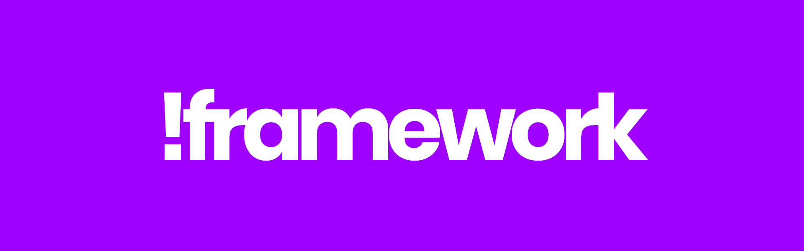
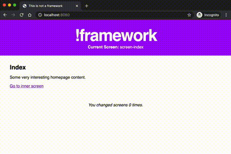

> Work in progress ⚠️

# 🙅 This is not a framework



**A minimal, zero-dependency boilerplate for building single-page applications using Web Components.**

**Current version:** 0.1 alpha.

---

## Summary
- [Concept](#concept)
- [Getting started](#getting-started)
- [Boilerplate Architecture](#boilerplate-architecture)
- [State management](#state-management)
- [Navigation management](#navigation-management)
- [Bundling the app](#bundling-the-app)
- [Serving the app](#serving-the-app)
- [Misc](#misc)

---

## Concept

This boilerplate proposes a structure for building front-end web applications projects using [Custom Elements](https://javascript.info/custom-elements), a feature that is part of the [Web Components specification](https://www.webcomponents.org/specs).

**Custom Elements are extremely powerful**, in that they allow to create HTML elements with self-contained logic and styling. They are [well supported by modern browsers](https://caniuse.com/custom-elementsv1), [simple to use](https://javascript.info/custom-elements), and since they are available out of the box, [using them generally results in much smaller JavaScript bundles](https://webcomponents.dev/blog/all-the-ways-to-make-a-web-component/), compared to JavaScript frameworks.

**The architecture proposed in this boilerplate is one of the many, many possible ways a single-page web application could be built using Web Components**. 

This is not in any way meant to be _"the optimal way"_ or even _"the right way"_ of doing so. Personal opinions and likings were most definitely a part of some of the choices made here, and this is clearly acknowledged.

**This boilerplate was put together, nonetheless, with a few principles in mind:**
- **Simplicity**: 
It has to be easy to understand, use and edit.
- **Standard:**
It must rely almost exclusively on features that are part of web standards specifications.
- **Independence**: 
It must not require any third-party software package to be used, besides a JavaScript runtime. No package.json, no Pipfile.

_☝️ [Back to summary](#summary)_

---

## Getting Started

### Pre-requisites
Although this boilerplate does not have software-level dependencies, you will need the following software on your machine:
- Any recent version of [Node JS](https://nodejs.org/en/)
- Any recent version of [Python 3](https://www.python.org/)

We also recommend using a UNIX-like system such as Mac OS or Linux, or the Windows Subsystem for Linux on Windows.

### Setting up the boilerplate
In a terminal, browse to the folder you want to set your project in, and run the following command to download and execute the [setup script](setup.sh):
```bash
curl https://raw.githubusercontent.com/matteocargnelutti/this-is-not-a-framework/main/setup.sh > setup.sh && chmod a+x setup.sh && ./setup.sh
```

### Checking that the boilerplate works
**Start the project by using the following command:**
```bash
node bundler.js && ./serve.sh 
# ☝️ Re-build the app and serve it locally over HTTP
```

Then open your browser and go to `http://localhost:8080`. 

**If all went well, the default demo app should be accessible:**
> 

See [this demo live](https://this-is-not-a-framework-basic-demo.netlify.app).

### Learning
We encourage you to start editing files of the default demo app to see how the boilerplate functions. Understanding a bit of JavaScript, and how [Custom Elements](https://javascript.info/custom-elements) work is recommended to help in that process.


_☝️ [Back to summary](#summary)_

---

## Boilerplate architecture

### 🌲 The Application Root
At the core of the boilerplate is [`<app-root>`](src/AppRoot.js), a custom element whose role is to be the parent of the entire application, [handle a global state](#state-management) and [basic navigation](#navigation-management).

[`index.html`](https://github.com/matteocargnelutti/this-is-not-a-framework/blob/main/index.html) includes an `<app-root>` tag, which triggers the creation of said element and executes the app's logic.

> 

The global HTML structure of the app is handled by `<app-root>`, and can be edited directly in [`AppRoot.renderInnerHTML()`](https://github.com/matteocargnelutti/this-is-not-a-framework/blob/main/src/AppRoot.js#L68).

There should be only one instance of `<app-root>` per application.

### ⚙️ Components
Components are independent [Custom Elements](https://javascript.info/custom-elements) that live ubder the `src/components` folder. They are the building blocks of your app.

The structure that was chosen for this boilerplate's elements is to generate the components' HTML within a `renderInnerHTML()` method, called at least once when the component is added to the page, and to store the CSS for this component in a separate, dedicated file.

```
- MyComponent.js # Component structure and logic
* MyComponent.css # Component styling
```

**Explore example of components:**
- [AppHeader](src/components/AppHeader.js)
- [AppFoter](src/components/AppFooter.js)

### 📺 Screens
In the context of this boilerplate, screens are a specialized type of component:
- Their name must start with `screen-`
- They must live in the `src/screens` folder _(or a subfolder)_
- `<app-root>` lists and uses those components for [navigation management](#navigation-management)
- `<app-root>` will render the currently loaded screen within `app-root > main`

**Explore example of screens:**
- [ScreenIndex](src/screens/ScreenIndex.js)
- [ScreenInner](src/screens/ScreenInner.js)

_☝️ [Back to summary](#summary)_

---

## State Management

This boilerplate comes [with a simple state manager](src/utils/StateManager.js) that can be used to allow custom elements to hold and share, but also react to changes in state.

### How it works
[`StateManager`](src/utils/StateManager.js) takes and holds and object that is considered a state. 

Access and edits to this object are regulated through the use of [an object Proxy](https://javascript.info/proxy), whose role it so **fire a `StateManagerUpdate` event, attached to the state holder**.

[See list of parameters and logic rules in StateManager's intro comment](src/utils/StateManager.js).

**Let's consider that our custom element `my-element` holds a state as follows:**
```javascript
this.state = new StateManager(
  this, // Parent of the state manager. In this case, this instance of <my-element> 
  'MyElementState', // Name of the state manager instance.
  { someRandomCounter: 0 } // Data to be held by the state manager. Could be a nested object.
);
```

Upon write access on `someRandomCounter`, a `StateManagerUpdate` event will be fired from our instance of `<my-element>`, containing the following data in its `detail` field, allowing to track changes.

```javascript
{
  'stateManagerName': 'MyElementState'
  'updatedProperty': 'someRandomCounter',
  'updatedPropertyPath': 'data'
  'newValue': 1,
  'previousState': {someRandomCounter: 0},
  'newState': {someRandomCounter: 1}
}
```

The fact that `StateManager` fires events when data changes allows other parts of the component or the app to react to changes in state:

```javascript
let myElement = this.querySelector('my-element');
myElement.addEventListener('StateManagerUpdate', this.doSomethingOnGlobalStateUpdate.bind(this));
```

### Example of an app-wide state management
`<app-root>` contains, by default, an instance of `StateManager` that can be used for global state management. From anywhere within the app, it is possible, via `document`, to access the `state` property of `<app-root>` to access shared data.

**See:**
- [Default, global state definition in `<app-root>`](https://github.com/matteocargnelutti/this-is-not-a-framework/blob/main/src/AppRoot.js#L14)
- Example of a component listening to changes in `<app-root>`'s state: [[1]](https://github.com/matteocargnelutti/this-is-not-a-framework/blob/main/src/components/AppHeader.js#L17) [[2]](https://github.com/matteocargnelutti/this-is-not-a-framework/blob/main/src/components/AppHeader.js#L29)

### Example of component-level state management
It is possible to create one or multiple `StateManager` instances attached to a given custom element. This is useful for component-level state management, when it does not make sense to share state across components.

**See:**
- [Example of a `StateManager` used at component-level](https://github.com/matteocargnelutti/this-is-not-a-framework/blob/main/src/components/AppFooter.js#L23).

### Using a different state manager
`StateManager` is provided for simplicity and out-of-the-box convenience. You are encouraged to replace it with more complex state management solutions if needed.

_☝️ [Back to summary](#summary)_

---

## Navigation Management

### Default behavior
This boilerplate offers a simplistic hash-based navigation system out of the box: Every screen element defined under `src/screens`, is accessible via a `/#!/` URI.

**For example:**
If current URL contains `/#!/contact-us`, `<app-root>` will make sure that the `<screen-contact-us>` element exists and, if so, clear `app-root > main` and inject a `<screen-contact-us>` tag there.

This logic is defined in [`<app-root>`](https://github.com/matteocargnelutti/this-is-not-a-framework/blob/main/src/AppRoot.js#L83) and can be extended / edited / removed at will.

As for the other out-of-the-box features of this boilerplate, this will likely not cover all uses cases, and you are encouraged to use a more sturdy custom navigation system to cover specific needs.

### Taking control
The `changeScreen(screenName)` method of `<app-root>` can be called directly to switch to a specific screen, without using hash-based navigation:

```javascript
let appRoot = document.querySelector('app-root');
appRoot.changeScreen('screen-test');
```

_☝️ [Back to summary](#summary)_

---

## Bundling the app

In the spirit of providing a dependency-free boilerplate, `This is not a framework` comes with an extremely basic JavaScript and CSS bundler, [`bundler.js`](https://github.com/matteocargnelutti/this-is-not-a-framework/blob/main/bundler.js).


### What this bundler does
- Lists all `*.js` and `*.css` files under `/src`
- Concatenate them as two files: `dist/bundle.js`, `dist/bundle.css`
- Allow you to change input and output paths

### What this bundle does _not_ do
- CSS and JS minification
- Transpiling to ES5
- Injecting polyfills
- Offer a _"watch"_ mode so bundles are re-built on the fly whenever a file is edited

As usual, you are encouraged to use a dedicated bundler as required to match your needs.

In some cases **you might not want to use a bundler at all** and directly import various sources, either via `<script>` tags in `index.html`

### Usage
In the default setup of the boilerplate, **the bundler has to be re-run after each edit to `/src`**.

To generate new bundles, simply run `bundler.js` with node:
```bash
node bundler.js
```

Depending on your operating system and setup, it is possible to instruct your system to run this command whenever a file is edited under `src/`. 
Example: [watchdog's watchmedo](https://github.com/gorakhargosh/watchdog#shell-utilities).

_☝️ [Back to summary](#summary)_

---

## Serving the app

The boilerplate comes with [`serve.sh`](https://github.com/matteocargnelutti/this-is-not-a-framework/blob/main/serve.sh), a quick shortcut serve the app locally via HTTP, with the help of Python's `http.server` package.

### Usage
Make sure your [app bundle is built](#bundling-the-app) and run the following.
```bash
./serve.sh
# index.html is now served on http://localhost:8080
```

### Limitations
- This is an extremely basic HTTP server and should only be used for development purposes.
- You are encouraged to upgrade to a third-party package with live-reload and local HTTPS support as required.

_☝️ [Back to summary](#summary)_

---

## Misc
- Please use [GitHub issues](https://github.com/matteocargnelutti/this-is-not-a-framework/issues) for bug reports and features requests.
- [VSCode extension to enable syntax highlighting for HTML in JavaScript template strings](https://marketplace.visualstudio.com/items?itemName=Tobermory.es6-string-html)
- [Web Components Tutorials on JavaScript.info](https://javascript.info/web-components)
- [Follow me on Twitter, @macargnelutti](https://twitter.com/macargnelutti)
- [Live demo of the default app](https://this-is-not-a-framework-basic-demo.netlify.app).


_☝️ [Back to summary](#summary)_
